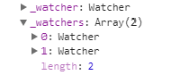
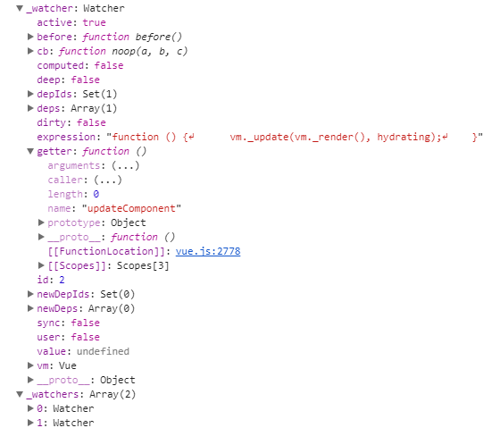
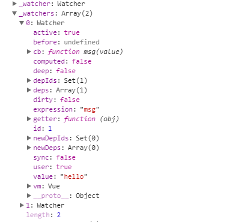

# Vue源码探究-数据绑定逻辑架构

*本篇源代码所在路径[vue/src/core/observer/](https://github.com/vuejs/vue/tree/v2.5.17-beta.0/src/core/observer)*

数据观察系统是Vue实现数据绑定、异步更新的核心模块，数据观察系统的实现也是Vue源码里最为复杂的部分，在仔细研究具体实现之前，先对整个数据绑定的逻辑架构进行一个充分的认识，会更有助于解读源码。

## 数据绑定逻辑架构
Vue的数据观察系统是基于发布者/订阅者模式，数据更新触发刷新页面的过程主要依赖数据观察系统里铁三角关系。在这个系统中，主要角色分别是 `Observer`、`Dep`、`Watcher` 这三个对象，对于每一个角色在观察数据更新的流程中各自承担的职责需要深入进行理解。下面请出三个主角登场，来介绍一下它们：

### Observer
`Observer` 相当于观察目标类，在数据绑定逻辑架构中的职责是收集需要观察的数据对象，进行变量存取器的包装，并递归地对每一个需要观察的对象注册发布者对象，再由发布者去注册相应的监视器。这里非常巧妙的是触发通知监视器数据更新的事件的注册，一般的发布订阅模式需要建立一个事件管理器或者调度中心来统一管理各种事件的注册，然而Vue的数据绑定不需要这样的机制，它借用 `Object.defineProperty` 方法来为每一个被监视的数据设置了存取器，依靠数据的存取行为自然地实现了事件的触发。在初始化Vue实例中设置的 `data` 属性时，对这些输入的数据对象对行了依赖追踪，包装后的变量存放在 `_data` 属性中，这个过程中发布者和监视器的依赖添加是不可见的；而通过配置 `watch` 属性显式设置的监视器，就可以在实例的 `_watchers` 私有属性中查看到。每个组件初始化后有一个唯一的 `_watcher` 对象，它是一个用来监视在 `data` 中注册的数据变动从而更新视图的监视器，它也默认被添加到了各属性的依赖监视数组中。在每个修改为可观察状态的属性中，都含有一个 `Dep` 实例即发布者，这个对象的 `subs` 属性就是用来存放依赖的所有监视器 `Watcher` 实例对象，`subs` 可以理解为订阅者，即所有订阅了该数据对象变动的监视器的数组集合。之所以需要在一开始为数据收集依赖，参考另一些开发者的总结是由于并非所有的数据都值得监视，要知道监视没有用到的数据就是对性能的浪费，在实例观察中也确实发现，页面中没有用到的属性，没有被初始化为依赖项，这样即便改变了它的数值，页面也不会触发多余的刷新。

### Dep
`Dep` 在Vue的数据观察者系统里充当发布者的角色，它不仅用来触发数据更新和建立依赖的事件，还用来存放每一个可监视数据所依赖的监视器，这个正是在第一步收集依赖时的重要一环。实例初始化的过程中收集了所有需要跟踪变化的数据，在运用 `Observer` 重新包装每一个属性的同时，创建了各自的 `dep` 对象，并在get和set方法中分别使用了 `Dep`的两个方法：`depend` 建立依赖，`notify` 通知变动。另外 `Dep` 还负责维护依赖监视器的增减。在构造 `Dep` 类的过程中，定义了全局的 `Dep.target` 对象和 `targetStack` 数组，`targetStack` 数组是用来存放待执行的 `watcher` 栈，`Dep.target` 是用来指代当前的监视器，必须唯一，它的存在对于建立监视器的依赖起到重要作用，在重置数据的 `getter` 时，当它存在时才执行建立数据与监视器的依赖，即只有显式配置了 `watch` 或创建了 `computed` 变量时才会在实例的私有属性里看到监视器。


### Watcher
`Watcher` 是这个架构中的监视器，充当观察者的角色。在Vue实例初始化的过程中，一定会默认创建一个监视器，这个监视器就是用来监视实例对象的数据变化用来更新视图的，实例的私有属性 `_watcher` 用来存放它。在创建可观察的数据时，每一个数据的 `Dep` 对象会收集监视器并建立依赖，当数据变化时，`Dep` 对象通知所有的监视器执行更新，执行更新有两种模式，如果依赖是通过配置 `computed` 变量创建的，则会立即触发相关的更新操作，如果数据的 `dep.subs` 数组中没有依赖的监视器，则默认惰性更新模式。`Watcher` 类最主要的作用是通知视图更新，众所周知视图的更新是非常花费时间，会影响程序性能，为了尽量减少视图更新导致的性能损失，在通知视图执行更新操作之前会有一个缓冲时段，在这个时段中会收集最后一次监视器收到的变更，减少不必要的重复更新，实现最优性能。

### 架构图示

充分了解了数据观察系统的三个主角之后，再来看看官网贴出的示意图，就会发现终于能摸清Vue的数据观察系统的架构了，只不过渲染视图的具体实现与数据观察系统的交互暂时还没有去摸索，以后会仔细地去探索，现在终于比较清晰地弄懂了Vue的数据绑定的原理了。


## 一个简单的实例

为了更清晰初步了解数据绑定相关的初始化过程，创建了一个非常简单的实例，data配置了两个属性，其中 `name` 变量并不在页面中使用，还显式设置了一个依赖 `msg` 的监视器。

```js
new Vue({
  data () {
    return {
      msg: 'hello',
      name: ''
    }
  },
  watch: {
    'msg' (value) {
      console.log('msg更新了')
    }
  }
})
```
下面截图是实例的相关监视器私有属性，`_watcher` 是跟踪页面渲染的监视器，每个实例唯一；`_wacthers` 是实例所拥有的所有监视器的集合。显式设置的 `watcher` 在是数组中的第一个对象。这里虽然看不到 `Observer` 背后的包装过程，但改变了 `msg` 属性之后，可以看到监视器执行的回调显示。







---

从Vue对象实例化着手到开始分析数据绑定的核心实现，这一路过来还没有真正遇到值得困扰的问题。但未曾想到的是，数据绑定这个Vue的核心特色功能竟然让我苦苦研读了好几天，似乎以前对于设计模式的了解显得那样无力。期间去搜索了一些前人做的分析说明文章以求从各个角度深入理解，但大多数解读读完后依然觉得没能很透彻地理解这个模块，后来读到了一个[简易实现Vue观察者系统的文章](https://www.jb51.net/article/107927.htm)，让我忽然对核心逻辑是如何实现的有了比较清晰的认识，而且对于设计模式也有了更深入的理解。也许第一次读源码的时候太多非核心的技术实现干扰了对于核心部分的理解，也因为之前的一些知识不牢固，所以从这一次学习中得到了一个很好的经验，要更加关注本质。

